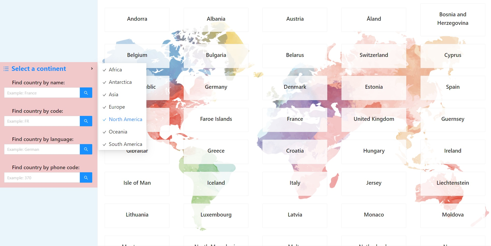

<p align="center">
  
  <h1 align="center">Find a country</h1>

  <p align="center">
    <i>
    A simple find-a-country-app with several search criteria (by country name, by language, by country code or by phone code). The app is fully responsive.
    Ant Design library components were used when creating and styling the project.
    </i>
    <br />
    <br />
    
</p>
</br>

# Table of Contents

- [:floppy_disk: Installation](#floppy_disk-installation)
- [:microscope: About the code](#microscope-about-the-code)

</br>

# :floppy_disk: Installation

1. Clone the repo:
   ```sh
   git clone https://github.com/yuryiva/find-country.git
   ```
2. Install NPM packages:
   ```sh
   npm install
   ```
3. Run the app in the development mode with `npm start`

# :microscope: About the code

The main technologies and tools used to build the Carousel are the following:

- React create-react-app
- Styled Components, Hooks
- Ant Design Components
